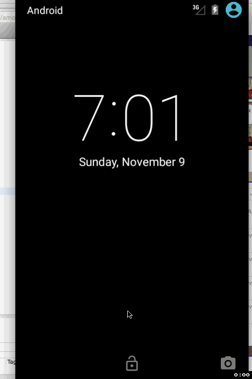

# TipCalculator App Demo

This is the Android demo for the TipCalculator app.
Time spent: Approximately 5 to 6 hours
Completed user stories:
   * User is diplayed the tip of specified percentage for specified entered amount.
   * User enters the total amount of the transaction
   * User can select between tip amounts (i.e. 10%, 15%, 20%)
   * Upon selecting the tip amount, formatted tip value is displayed.
   * User changes the total amount and the updated tip is reflected automatically.
   * User can select a custom tip percentage if desired.
   * User can select how many ways to split the tip.
   * Experiment with trying input widegets to replace the buttons.

